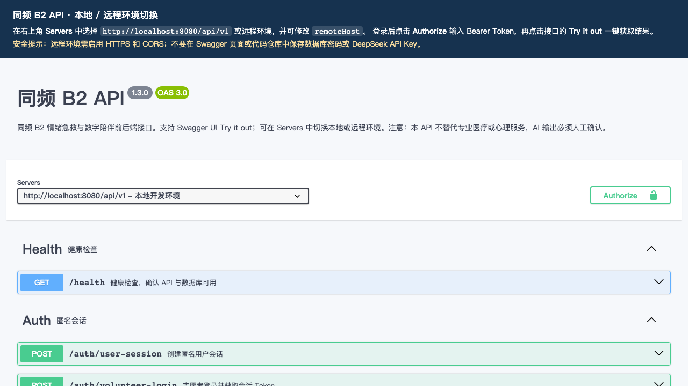
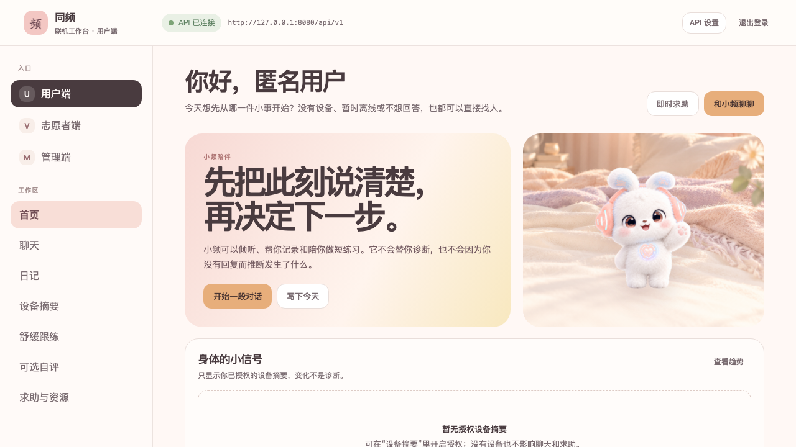
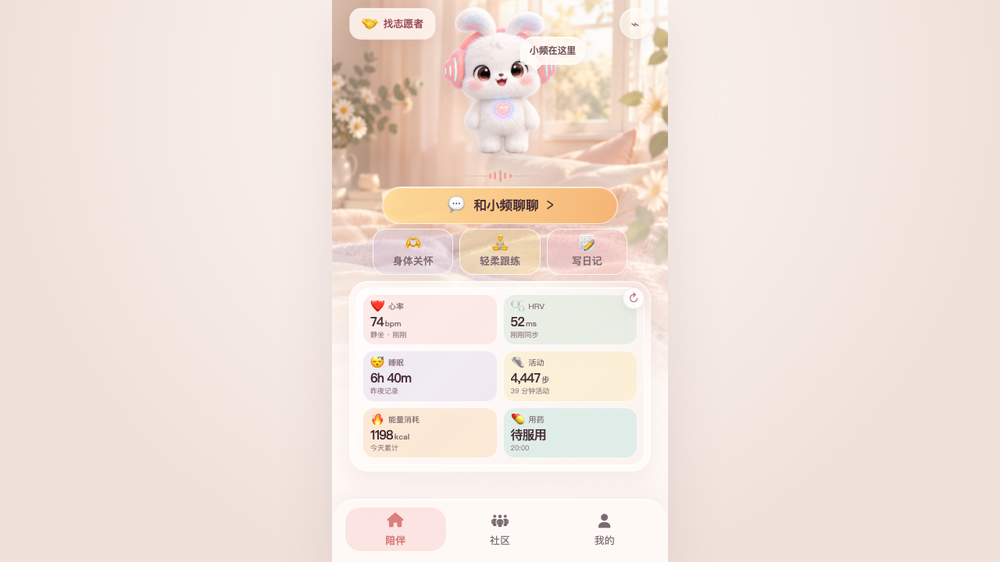

# HoldU / 同频 B2 Backend Service

HoldU / 同频 B2 的后端服务，用于支持青少年情绪急救与数字陪伴场景。当前实现是一个 **Node.js + NestJS + TypeScript + MySQL 8** 模块化单体：MySQL 是唯一状态事实来源，不依赖 Redis、Kafka 或 RabbitMQ。

## 项目简介

服务包含五类核心能力：

- **用户端**：匿名会话、资料与授权、聊天、日记、设备摘要、舒缓跟练、可选自评、即时安全求助与人工陪伴请求。
- **志愿者端**：个案列表、原子接单、会话沟通、结束陪伴、休息、自检、排班、容量控制、普通交接与专业求助。
- **管理端**：辖区总览、用户摘要、人员与排班、交接确认、专业接管、支持分层复核、审计与现实资源维护。
- **AI 辅助**：DeepSeek 模型配置、提示词、skills、tools、发布门禁、白名单只读工具、安全检查、降级与审计；AI 输出必须人工确认。
- **事件能力**：MySQL 事务性 Outbox、SSE 推送与断线轮询兜底。

服务内置 Swagger UI、管理端联机工作台和移动端 PWA 演示页，便于本地联调、演示和接口验收。

## 项目结构

```text
backend-service/
├── deploy/                    # systemd 部署说明与服务模板
├── docs/usage/                # README 使用的运行截图
├── public/
│   ├── index.html             # Swagger UI
│   ├── openapi.yaml           # OpenAPI 3 契约
│   ├── portal/                # 用户 / 志愿者 / 管理端联机工作台
│   └── mobile-pwa/            # 用户端移动 PWA
├── scripts/
│   ├── migrate.ts             # 创建数据库并执行 schema
│   └── seed.ts                # 写入演示账号、资源与 AI 配置
├── sql/schema.sql             # MySQL 表结构
├── src/
│   ├── controllers/           # HTTP 路由与参数处理
│   ├── services/              # 认证、个案、AI、审计与事件业务逻辑
│   ├── app.module.ts          # NestJS 模块装配
│   ├── auth.ts                # Token 会话与角色守卫
│   ├── config.ts              # 环境变量配置
│   └── database.module.ts     # MySQL 连接池
└── test/
    ├── unit/                  # 安全工具、AI 安全检查与领域对象测试
    └── e2e/                   # 真实 HTTP + MySQL 全链路测试
```

## 环境要求

- Node.js `>= 20`
- npm `>= 10`
- MySQL `8.x`

## 本地初始化

1. 安装依赖：

   ```bash
   npm install
   ```

2. 创建环境文件：

   ```bash
   cp .env.example .env
   ```

3. 修改 `.env` 中的数据库配置：

   ```env
   DB_HOST=127.0.0.1
   DB_PORT=3306
   DB_USER=tongpin_app
   DB_PASSWORD=your-password
   DB_NAME=tongpin_b2
   ```

   `DB_USER` 需要有创建 `DB_NAME` 数据库和执行 DDL 的权限。示例：

   ```sql
   CREATE USER 'tongpin_app'@'%' IDENTIFIED BY 'your-password';
   GRANT ALL PRIVILEGES ON `tongpin_b2`.* TO 'tongpin_app'@'%';
   FLUSH PRIVILEGES;
   ```

4. 初始化数据库与种子数据：

   ```bash
   npm run db:migrate
   npm run db:seed
   ```

   种子数据仅用于本地和演示环境，不要在生产环境执行。可通过 `SEED_PASSWORD` 覆盖默认演示密码。

5. 启动开发服务：

   ```bash
   npm run dev
   ```

默认地址：

```text
API Base:  http://localhost:8080/api/v1
Health:    http://localhost:8080/api/v1/health
Swagger:   http://localhost:8080/api/v1/docs
工作台:    http://localhost:8080/api/v1/docs/portal/
移动 PWA:  http://localhost:8080/api/v1/docs/mobile-pwa/
```

## 演示账号

执行 `npm run db:seed` 后可用：

| 角色 | 账号 | 默认密码 |
|---|---|---|
| 志愿者 | `volunteer.lin` | `TongpinDemo2026!` |
| 志愿者 | `volunteer.zhou` | `TongpinDemo2026!` |
| 值班负责人 | `manager.xu` | `TongpinDemo2026!` |
| 专业督导 | `supervisor.chen` | `TongpinDemo2026!` |
| AI 配置管理员 | `ai.admin` | `TongpinDemo2026!` |

生产环境必须更换演示密码，并仅授予必要权限。

## 使用方式

### 1. Swagger 调试 API

打开 `http://localhost:8080/api/v1/docs`，在右上角 `Servers` 选择本地环境。需要鉴权的接口先调用登录接口拿到 Token，再点击 `Authorize` 填入 Bearer Token，最后使用 `Try it out` 执行请求。



常用 curl 示例：

```bash
# 健康检查
curl http://localhost:8080/api/v1/health

# 创建匿名用户会话
curl -X POST http://localhost:8080/api/v1/auth/user-session \
  -H 'Content-Type: application/json' \
  -d '{"age_band":"18+","district_id":"district_shanghai_a"}'

# 使用返回的 token 获取当前用户
curl http://localhost:8080/api/v1/me \
  -H 'Authorization: Bearer <access-token>'
```

### 2. 联机工作台

打开 `http://localhost:8080/api/v1/docs/portal/`：

- **用户端**：点击“创建匿名会话”，进入首页后可使用聊天、日记、设备摘要、舒缓跟练、可选自评、求助与资源、即时求助。
- **志愿者端**：选择“志愿者端”，使用演示志愿者账号登录，进入接单中心和当前陪伴工作区。
- **管理端**：选择“管理端”，使用值班负责人或专业督导账号登录，查看辖区总览、排班、交接、专业接管、审计和资源。



### 3. 移动端 PWA

打开 `http://localhost:8080/api/v1/docs/mobile-pwa/`，页面会自动创建匿名会话，并复用同一套 API 完成聊天、日记、跟练、求助与事件订阅。部署到 HTTPS 后，可在手机浏览器中选择“添加到主屏幕”。



## 常用脚本

| 命令 | 说明 |
|---|---|
| `npm run dev` | 以 watch 模式启动开发服务 |
| `npm run build` | 编译 TypeScript 到 `dist/` |
| `npm run start` | 运行编译产物 |
| `npm run db:migrate` | 创建数据库并执行表结构 |
| `npm run db:seed` | 写入演示数据 |
| `npm run typecheck` | TypeScript 类型检查 |
| `npm test` | 单元测试 |
| `npm run test:e2e` | 真实 HTTP + MySQL E2E 测试 |
| `npm run verify` | 类型检查、单元测试、E2E 测试和构建 |

E2E 测试默认使用 `tongpin_b2_test` 数据库，不会写入业务库。

## 配置说明

| 变量 | 说明 |
|---|---|
| `PORT` | 服务端口，默认 `8080` |
| `BASE_PATH` | API 前缀，默认 `/api/v1` |
| `DB_HOST` / `DB_PORT` | MySQL 地址与端口 |
| `DB_USER` / `DB_PASSWORD` | MySQL 账号 |
| `DB_NAME` | 业务数据库名 |
| `CORS_ORIGINS` | 允许的前端来源，逗号分隔；生产环境不要使用 `*` |
| `DEEPSEEK_API_KEY` | DeepSeek API Key；为空且允许 mock 时可本地演示 |
| `DEEPSEEK_MODEL` | 默认模型 |
| `AI_ENABLED` / `AI_ALLOW_MOCK` | AI 开关与 mock 降级 |
| `AI_TIMEOUT_MS` / `AI_MAX_RETRIES` | AI 超时与重试 |
| `AI_DAILY_TOKEN_BUDGET` | 每日 Token 预算 |
| `EVENT_POLL_INTERVAL_MS` | 事件轮询间隔 |

不要提交 `.env`、数据库密码、DeepSeek API Key 或真实用户数据。

## 生产部署

推荐使用 systemd 部署，完整步骤见 [`deploy/README.md`](deploy/README.md)。

```bash
cd /opt/HoldU/backend-service
npm ci
npm run build
cp .env.example .env
# 编辑生产 .env
npm run db:migrate

sudo cp deploy/tongpin-backend.service /etc/systemd/system/tongpin-backend.service
sudo systemctl daemon-reload
sudo systemctl enable --now tongpin-backend
sudo journalctl -u tongpin-backend -f
```

生产建议：

- 只使用内网或本机 MySQL，并为应用创建独立最小权限账号。
- 通过 Nginx / HTTPS 反向代理暴露 API，并为 SSE 关闭缓冲。
- 限制 Swagger 与演示页面访问范围。
- 不执行 `db:seed`，不保留默认演示账号。
- 更新代码后执行 `npm ci`、`npm run build`、`npm run db:migrate`，再重启服务。

## 安全边界

本服务不提供医疗诊断、疾病预测、自动报警、自动外呼，也不能替代专业心理服务。AI 输出必须经过人工确认，不能自动发送给用户或触发外部动作。

当前实现属于黑客松原型和工程验证，不代表真实机构服务、临床效果或全天候值守能力。
